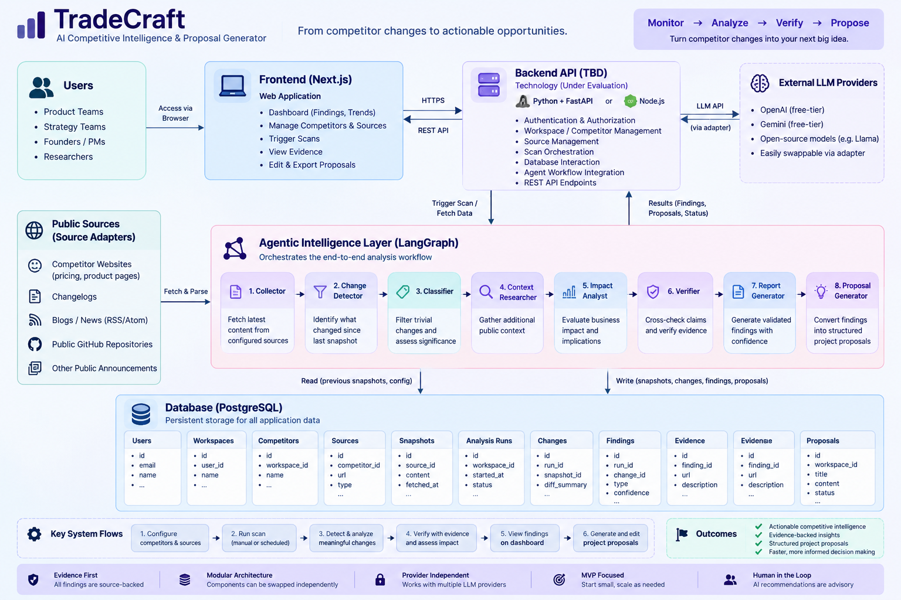

# TradeCraft System Architecture



## 1. Architecture Overview

TradeCraft is a full-stack application that monitors public competitor sources, detects meaningful changes, investigates supporting context, evaluates potential impact, verifies evidence, and generates actionable competitive intelligence and project proposals.

The MVP follows a modular architecture so that individual technologies can be changed without redesigning the complete system.

## 2. High-Level Architecture

The system consists of six major layers:

1. Frontend Layer
2. Backend API Layer
3. Agentic Intelligence Layer
4. Source Adapter Layer
5. Database Layer
6. LLM Layer

## 3. Backend Technology Decision

The backend technology is currently under evaluation.

### Candidate Options

- Python + FastAPI
- Node.js + suitable API framework

The final backend technology will be selected based on:

- LangGraph and agent workflow integration
- LLM ecosystem compatibility
- Development speed
- Team familiarity
- Testing requirements
- Deployment considerations
- Frontend and database integration

Until the decision is finalized, this component is referred to as the **Backend API**.

## 4. Frontend Layer

The frontend provides the user-facing web application.

### Responsibilities

- Authentication interface
- Workspace management
- Competitor management
- Source configuration
- Scan controls
- Findings dashboard
- Evidence visualization
- Proposal editing
- Proposal export/copy workflow

### Technology

```text
Next.js
React
```

## 5. Backend API Layer

The backend acts as the main application layer between the frontend, database, source adapters, and agentic workflow.

### Responsibilities

- Authentication and authorization
- Request validation
- Workspace management
- Competitor management
- Source management
- Scan orchestration
- Database interaction
- Agent workflow integration
- REST API endpoints

### Technology Status

```text
Backend API: TBD

Candidate:
- Python + FastAPI
- Node.js + suitable API framework
```

The frontend communicates with the backend through a stable API boundary so that the backend implementation can be changed without redesigning the overall application.

## 6. Agentic Intelligence Layer

The agentic intelligence layer transforms raw competitor changes into validated competitive intelligence.

### Planned Orchestration

```text
LangGraph
```

### Workflow

```text
START
  ↓
Collector
  ↓
Change Detector
  ↓
Change Classifier
  │
  ├── No meaningful change → END
  │
  ↓
Context Researcher
  ↓
Impact Analyst
  ↓
Critic / Verifier
  │
  ├── Rejected / insufficient evidence → END
  │
  ↓
Report Generator
  ↓
Optional Proposal Generator
  ↓
END
```

### Agent Responsibilities

| Agent | Responsibility |
|---|---|
| Collector | Fetch configured public sources and latest snapshots |
| Change Detector | Determine what changed since the previous snapshot |
| Change Classifier | Filter trivial changes and classify significance |
| Context Researcher | Gather additional supporting context |
| Impact Analyst | Relate the change to the user's product/project context |
| Critic / Verifier | Challenge unsupported claims and assess evidence |
| Report Generator | Produce facts, interpretation, evidence, confidence, and recommendation |
| Proposal Generator | Convert validated findings into a structured project proposal |

## 7. Source Adapter Layer

Source adapters retrieve and normalize public competitor information.

### Planned Sources

- Competitor pricing pages
- Competitor product pages
- Changelogs
- Blogs / RSS / Atom feeds
- Public GitHub repositories
- Other public announcements where applicable

### Source Processing

```text
Public Source
     ↓
HTTP Fetch
     ↓
Parser / Content Extraction
     ↓
Normalized Source Data
     ↓
Snapshot Storage
     ↓
Change Detection
```

The MVP should prefer simple HTTP fetching and parser-based extraction where practical. Complex browser automation should only be introduced when a selected source requires JavaScript rendering.

## 8. Database Layer

PostgreSQL is planned as the primary application database.

The database stores application state, source snapshots, analysis results, evidence, and generated proposals.

### Main Entities

```text
Users
  │
  ▼
Workspaces
  │
  ├── Competitors
  │      └── Sources
  │             └── Snapshots
  │
  └── Analysis Runs
          ├── Changes
          └── Findings
                 └── Evidence

Workspaces
    │
    └── Proposals
```

### Planned Tables

| Table | Purpose |
|---|---|
| users | User accounts |
| workspaces | Product/project context |
| competitors | Competitor profiles |
| sources | Configured public URLs |
| snapshots | Previously fetched source content |
| analysis_runs | Individual scan executions |
| changes | Detected source changes |
| findings | Validated competitive intelligence |
| evidence | Source-backed supporting evidence |
| proposals | Generated project proposals |

## 9. Data Flow

The main system flow is:

```text
User
  ↓
Next.js Frontend
  ↓
Backend API
  ↓
Start Scan
  ↓
Source Adapters
  ↓
Fetch Current Sources
  ↓
Store / Compare Snapshots
  ↓
Detect Changes
  ↓
LangGraph Workflow
  ↓
Classify
  ↓
Research
  ↓
Impact Analysis
  ↓
Verification
  ↓
Validated Finding
  ↓
Dashboard
  ↓
Optional Proposal Generation
```

## 10. Evidence Flow

Every intelligence finding must maintain a connection to its supporting source evidence.

```text
Public Source
      ↓
Source Snapshot
      ↓
Detected Change
      ↓
Candidate Finding
      ↓
Supporting Evidence
      ↓
Verification
      ↓
Validated Finding
```

The system clearly separates:

### FACTS

Information directly observed from collected source evidence.

### INTERPRETATION

AI-generated analysis of what the observed change may mean.

### RECOMMENDATION

A suggested next step based on the evidence and interpretation.

AI-generated interpretation and recommendations should never be presented as observed competitor facts.

## 11. LLM Layer

The LLM layer provides language-model capabilities to the agentic workflow.

The application should not depend on a single paid AI provider.

### Architecture

```text
Agent Workflow
      ↓
LLM Adapter
      ↓
Configurable Provider / Model
```

The provider and model should be configurable through environment variables.

The architecture should support:

- Free-tier providers
- Open-source models
- Replaceable model providers
- Graceful handling of model failures and rate limits

The exact provider and model will be finalized during implementation.

## 12. API Boundary

The frontend communicates with the backend through a stable REST API boundary.

### Planned MVP Endpoints

```text
POST   /auth/login

POST   /workspaces
GET    /workspaces

POST   /workspaces/{id}/competitors
POST   /competitors/{id}/sources

POST   /workspaces/{id}/scan

GET    /workspaces/{id}/runs
GET    /runs/{id}

GET    /findings/{id}
POST   /findings/{id}/dismiss

POST   /proposals
GET    /proposals/{id}
PUT    /proposals/{id}
```

The endpoint implementation may vary depending on the final backend technology choice.

## 13. Primary User Workflow

```text
1. Configure workspace
        ↓
2. Add competitors
        ↓
3. Configure public sources
        ↓
4. Run scan
        ↓
5. Fetch and snapshot sources
        ↓
6. Detect changes
        ↓
7. Classify meaningful changes
        ↓
8. Research supporting context
        ↓
9. Analyze likely impact
        ↓
10. Verify evidence
        ↓
11. Display validated findings
        ↓
12. Select finding
        ↓
13. Generate project proposal
        ↓
14. Edit proposal
        ↓
15. Export / copy proposal
```

## 14. Design Principles

### Modularity

Each major component should have a clear responsibility and interface so that technologies can be replaced independently.

### Evidence First

Competitive-intelligence findings must be grounded in source-backed evidence.

### Human in the Loop

AI recommendations are advisory. The system should not perform external business actions without user approval.

### Provider Independence

LLM providers should be replaceable through configuration rather than being hard-coded into business logic.

### Deterministic First

Deterministic processing such as source comparison, hashing, and trivial-change filtering should happen before unnecessary LLM calls.

### Minimal Infrastructure

The MVP should avoid unnecessary infrastructure such as microservices, Kubernetes, or distributed task systems unless a concrete requirement emerges.

### Reproducibility

Source URLs, timestamps, snapshots, run information, and evidence should be retained so that findings can be traced back to their origin.

## 15. Current Technology Decisions

| Component | Current Status |
|---|---|
| Frontend | Next.js / React |
| Backend API | **TBD — FastAPI or Node.js** |
| Database | PostgreSQL |
| Agent Orchestration | LangGraph |
| Source Ingestion | HTTP + HTML/RSS parsers |
| LLM Provider | **TBD — Free/Open-source/Free-tier** |
| Scheduler | Later / Optional |

## 16. Architecture Status

**Status: Initial Architecture Design**

This document represents the initial architecture derived from the project requirements.

The following decisions remain open:

- Final backend technology: FastAPI or Node.js
- Exact LLM provider/model
- Whether public GitHub monitoring is included in the MVP or treated as a stretch source
- Whether browser automation is required for any selected demo competitor
- Final proposal export format

These decisions will be finalized during implementation and documented through subsequent GitHub commits.
